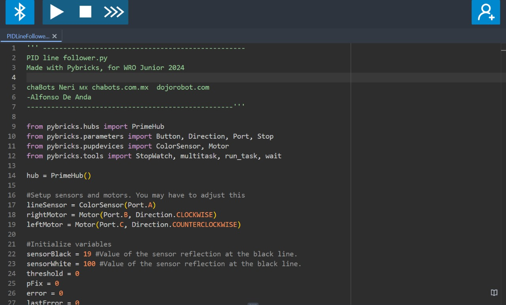
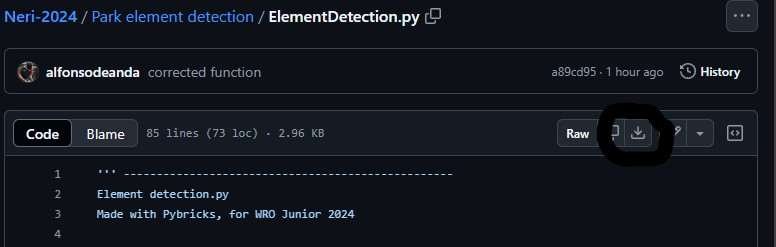

# WRO Junior 2024 - ChaBots Neri

----

## About

This repository contains Python programs made with Pybricks, to make precise spceific functions for LEGO Education's Kit SPIKE Prime. These functions were made for a bigger program to solve the challenge for the 2024 Junior category in the World Robot Olympiad.

The objective of this repo, is to make easier for other teams in the WRO and students using the same tecnology as us for making this kind of precise functions, such as Line Following, or making a precise 90 degree turn using the built-in gyroscope.

----

## Content

## Gyroscope

### ・One wheel gyro turning
  
  Function to make a precise turn to any direction (0 - 360°) only moving one wheel

### Own axis gyro turning
  
  Function to make a precise turn to any direction (0 - 360°) moving both wheels at same time in diffferent directions

## Line Follower

### ・Line following by rotations
  Function to execute a PID Line Follower during certain number of rotations, determined by motor encoders

### ・PID Line Follower
  Function to execute a PID Line Follower forever

## Park element detection

### ・Element detection
  Algorithm that determines the type of elements (tree or duck) are in the right of the robot, using a color sensor.

----

## Getting Started

- First, you should install the Pybricks App [here](https://code.pybricks.com/), or just initialize the online compiler.

- Then, click "Install Pybricks Firmware" in the settings section, and follow the instructions. This will reset the firmware of your SPIKE Hub, so you can upload Pybricks code to it.

- Now, to use any of my programs in your hub, you have to search the program you would like to use in the repo. Then, click the download raw file button.

  

- Go back to the Pybricks compiler. Now click on import a file, and select the file you just downloaded from Github

- You are good to go!, you now have my program in your computer, ready to execute. Connect to you SPIKE Prime Hub, and run the program. Though you may need to adjust the setup values

----

Hope this repository helps people!, if you have any issues, please contact me

# Contact
Discord - @alfonso.dn
Twitter - 
